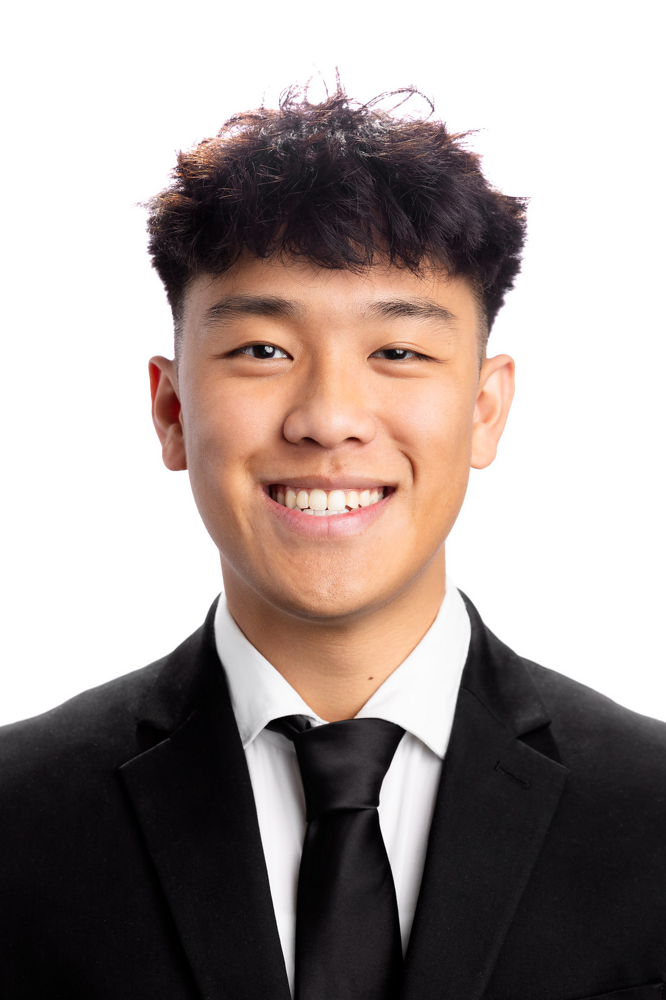

# I'm Harrison Le

## Who I am
I am a third year *Computer Science* major here at UCSD. I enjoy **building** things and hope to be able to ship out products that ***millions of people use!***. 

---

## Favorite Quote
> “"I have not failed. I've just found 10,000 ways that won't work." – Thomas Edison”
   
## Hobbies and interests
- Golf
- Weightliting
- Basketball
- Financial Freedom

## Technical
- Java
- C
- C++
- Python
- Sales :)

## Projects
1. **[Bay Area Covid Tutoring](https://github.com/Harrisonle128/BACT)**  
   A platform connecting tutors with students which came from the disparities that were prevalent during COVID-19.

2. This one!

## Favorite Piece of Code 

```java
public class HelloWorld {
    public static void main(String[] args) {
        System.out.println("Hello, World!");
    }
}
```

[My Technical abilities](#technical)


- [x] Finish Lab 1
- [ ] Start Lab 2

## My Profile Picture

[Click here to view my profile picture](screenshots/Harrison.JPG)



